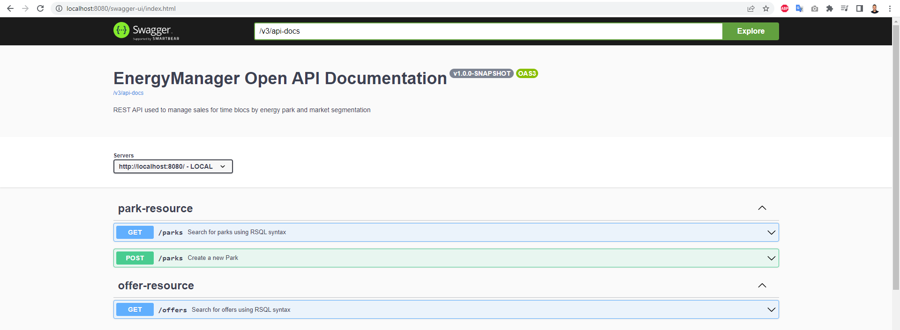

# Energy Manager

## Context

Part of Energy-Manager's business is to sell energy on several markets, there are 3 main markets, that of
Primary Reserve, Secondary Reserve and Quick Reserve. On each of these markets, an offer is made up of a
quantity of energy (in MW) that will be delivered over an hourly "block" (a 24-hour day could contain 8 blocks of 3
hours), and a floor price for this hourly block below which we will not sell.

Electricity-generating parks, of different types (solar, wind or hydraulic), are capable of supplying
a certain number of MegaWatts during a block of time. To enable the traceability of electricity production (
guarantee of origin), it must be possible to know the park which will produce the electricity of an offer.

This application offers APIs for creating an offer, creating a park, listing the offers offered by Energy-Manager 
for each market and obtaining the list of parks selling on a market.

## Technical stack

- Java 17
- Docker to run the database
- Spring boot 2.7.0 to start coding right away without wasting time on preparing and configuring the environment.
- Lombok to reduce boilerplate code for model/data objects
- Vavr to reduce the amount of code and to increase the robustness for functional programming
- SpringDoc to simplify the generation and maintenance of API docs based on the OpenAPI 3 specification

The project is made following **Hexagonal Architecture** isolating the domain layer and offering a loosely coupled application

## How to run the project

First we need to start the database by executing the `docker-compose.yml` file at the root of the project:
```
docker-compose up -d
```
We can then run our application:
```
java -jar target/energy-manager-1.0.0.jar
```
After running the application we can access the doc:
```
http://localhost:8080/api-doc.html
```
And see the chnges in the dockerized database:
```
http://localhost:5050/browser/
```

